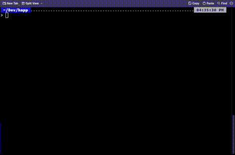

# nest-datum-deploy-mgr 123
Simple [nest-datum services](https://github.com/orgs/nest-datum-lib/repositories) deployment manager that can short the time of **pulling**, **cloning**, **checkouting** for many of services at once.

## Install requirements
### **LINUX ONLY!**
- **Ubuntu**
`apt install dialog`

- **Arch**
`pacman -S dialog`

## Guide

### clone & init

    git clone git@github.com:KR1470R/services-deploy-mngr.git
    cd services-deploy-mngr

### install

    chmod +x deploy
    sudo cp deploy /usr/share/bin

You can use another path rather than `/usr/share/bin`, just keep in mind that the path must be in `$PATH`  variable in order to run your program anywhere.
### usage

 `deploy <branch_name> <dir_destination?> `

    OPTIONS:
    -> branch_name - name of the branch you want to pull from
    -> dir_destination(optional) - absolute path to the directory where services will be loaded,   if not specified, the program will ask you use PWD.

### Demo

    

